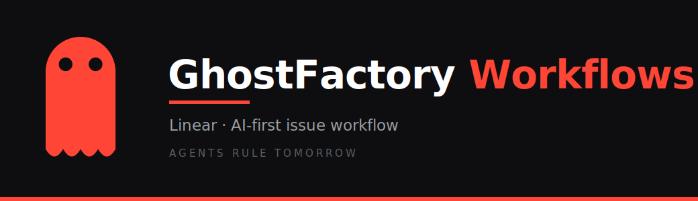
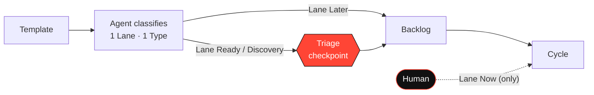

<p align="center">
  
</p>

# GhostFactory Workflows

> Tired of reading? Let your AI read this repo :)

Workflows, issue models and reusable AI skills for **AI-first product development** — where issues are created by agents (Claude, Linear Agent, …), not humans.

If most of your issues are generated by AI, your backlog grows faster than it shrinks: every session review spawns new issues, solving them spawns more, and you spin in place. This repo is the system that stops that.

> **The model in one sentence:** Templates give structure → agent gives first classification → Triage gives the checkpoint → human decides on active work.

---

## Who this is for

- Solo founders / small teams running product development with heavy AI-agent assistance
- Anyone using **Linear as a control plane** where agents create most issues
- Reusable as a pattern for any AI-assisted team — not Linear-specific in spirit

---

## The core idea

Every issue carries exactly **one Lane** (when/how) and **one Type** (what kind of work):

| Lane | Meaning | Who sets it |
|---|---|---|
| `Lane Now` | Actively being worked on | **Human only** |
| `Lane Ready` | Concrete, ready for planning | Agent → Triage |
| `Lane Discovery` | Needs a decision or scope clarity | Agent → Triage |
| `Lane Later` | Valid work, but not now | Agent → Backlog |

| Type | Use when |
|---|---|
| `Type Bug` | Broken behavior, regression |
| `Type Feature` | New capability / deliverable |
| `Type Discovery` | Open question, audit, architecture decision |
| `Type Follow-up` | Comes from a review or completed issue |
| `Type Tech Debt` | Cleanup, refactor, hardening — no open question |

**Critical rule:** if an issue has an open question or needs a decision before implementation → `Type Discovery`, even if it looks like Tech Debt.

**Triage = checkpoint, not a trigger.** AI-generated `Lane Ready` and `Lane Discovery` issues go through Triage as a second check before backlog. `Lane Later` may go straight to backlog. `Lane Now` is never set by an agent.



---

## What's in here

```
ghostfactory-workflows/
├── README_AI.md          — quick reference for AI agents
├── linear-workflow/          🎯 the Linear setup (start here)
│   ├── workflow.md               full guide: model, Triage, hybrid model, rollout
│   ├── setup/                    copy-paste configs mapped to Linear settings
│   ├── policy/                   issue policy, automation spec, template selection, label schema
│   ├── skills/                   7 AI skills for issue creation / triage / hygiene
│   ├── templates/                5 issue templates (Bug · Feature · Discovery · Follow-up · Tech Debt)
│   └── claude-skill/             bonus: installable Claude Code skill bundling the whole workflow
└── product-dev/              🧩 general AI skills (tracker-agnostic)
    └── skills/                   6 skills: PRD→issue tree, impl spec, release notes, reporting
```

---

## How to use it

Pick the track that matches your goal.

### A. Set up the workflow in your own Linear
1. Read [`linear-workflow/workflow.md`](linear-workflow/workflow.md) for the full model + rollout phases.
2. Open [`linear-workflow/setup/`](linear-workflow/setup/) — each file maps to one Linear settings section and is copy-paste-ready:
   - `setup/workspace-ai-agents/` → `settings/ai-agents` (Linear agent guidance + agent personalization)
   - `setup/team-workflow-triage/` → `team-settings/workflow/triage` (agent automation + triage intelligence)
3. Create the `Lane *` and `Type *` labels in your workspace.
4. Use [`linear-workflow/policy/`](linear-workflow/policy/) as your team's source of truth.

### B. Add the AI skills to your Linear agent
The files in [`linear-workflow/skills/`](linear-workflow/skills/) are agent **skills**, not throwaway prompts. Register each one in Linear under `settings/ai-agents` → agent personalization → **Skills** (the section below guidance). The agent then picks the right skill per task. You can also use any skill with another agent (e.g. Claude) by giving it the skill body.

- Session review → `create-gf-issues`, `bug-report-from-notes`, `feature-request-to-backlog`, `issue-from-informal-input`
- Backlog hygiene → `triage-issue`, `backlog-grooming`, `prioritize-backlog-item`
- Bigger scope / reporting → see [`product-dev/skills/`](product-dev/skills/)

### C. Use the issue templates
Copy a file from [`linear-workflow/templates/`](linear-workflow/templates/) as the body of a new issue. The [Template Selection Rules](linear-workflow/policy/template-selection-rules.md) tell you which one to pick.

---

## Customize

Setup and policy files use placeholders so you can adapt them:

- `<TEAM>` — your team name
- `<PROJECT>` — a project name
- `<DOMAIN_LABEL>` — a domain label

Files ending in `.template.md` contain placeholders plus an `> Example (GhostFactory): …` block showing a real value. Replace the placeholders; keep or drop the examples.

---

## Context

Built and used in production as part of the [GhostFactory .ART](https://ghostfactory.art) ecosystem for building and operating AI agents.

> Agents Rule Tomorrow.

## License

MIT — use freely, adapt as needed. See [LICENSE](LICENSE).
